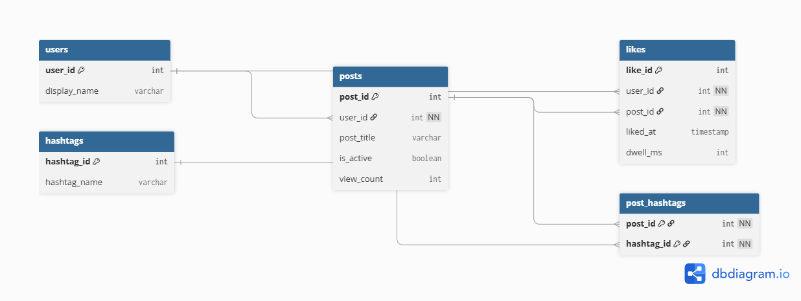

# EX 603 Social Media Database

**Student:** Sahid Bangura  
**Course:** EX 603  
**Theme:** Social Media

A relational database design for a social media platform that manages users, posts, likes, hashtags, and post-to-hashtag relationships.

## Domain

This project models a simplified social media platform. Users create posts, and each post belongs to exactly one user. Posts include an active/inactive state and a view count so the platform can distinguish current content and answer questions about content popularity. Users can also like posts. Each like records the user, the post, the time of the interaction, and a dwell-time metric that can support engagement analysis.

Hashtags classify posts. Because a post can have many hashtags and a hashtag can classify many posts, the design uses the `post_hashtags` junction relation to represent the many-to-many relationship. The model must answer questions such as: Which user created a post? Which posts receive the most views or likes? Which users liked a particular post? How long did users engage with content? Which hashtags are associated with a post, and which posts use a particular hashtag?

The design also prevents invalid states such as orphaned posts or likes, negative view counts or dwell times, duplicate post-hashtag associations, and references to users, posts, or hashtags that do not exist.

## Entity Relationship Diagram

## Unit 1 Files

- `schema/erd.png` — exported ERD image
- `schema/erd.dbml` — editable dbdiagram.io source
- `schema/schema-definition.md` — relation schemas, attributes, domains, and primary keys
- `schema/constraints.md` — integrity constraints and ON DELETE decisions
- `analysis/unit1.md` — modelling justification and reflection
- `queries/` — reserved for later units
- `screenshots/` — reserved for later units
